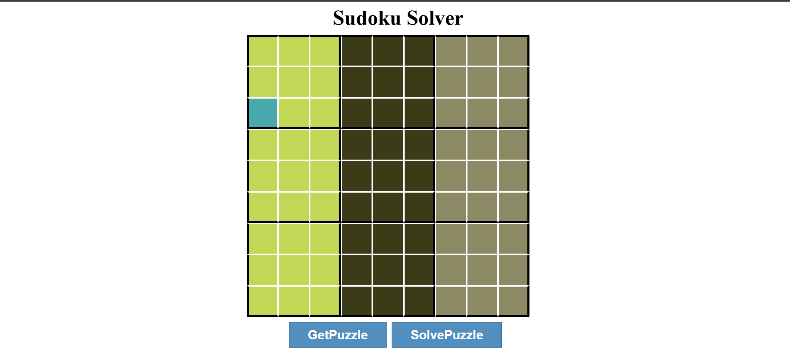

# Sudoku-Solver# 🧩 Sudoku Solver (Web App)

A web-based Sudoku Solver built using **HTML**, **CSS**, and **JavaScript**.  
You can input a Sudoku puzzle, validate it, and solve it instantly using a backtracking algorithm.

---

## 🚀 Features

- Click-to-select Sudoku grid interface
- Keyboard input (1-9) for filling cells
- Auto-validation of board with error highlighting
- Instant solution using backtracking algorithm
- Fetch new puzzles from online API

---

## 📸 Demo

 <!-- Upload and replace with actual image -->

---

## 🛠️ Tech Stack

- HTML5, CSS3
- JavaScript (Vanilla)
- Sudoku API: [sugoku.onrender.com](https://sugoku.onrender.com/board)

---

## 🧠 How it Works

- Uses backtracking algorithm to solve Sudoku
- Validates rows, columns, and 3x3 subgrids
- Interacts with DOM to update board dynamically

---

## 📦 Setup Instructions

# 1. Clone the repository

git clone https://github.com/nandinisharma166/Sudoku-Solver.git

# 2. Move into the project directory

cd Sudoku-Solver

# 3. Open the app in your browser

# (You can just double-click index.html or run it using a Live Server in VS Code)
